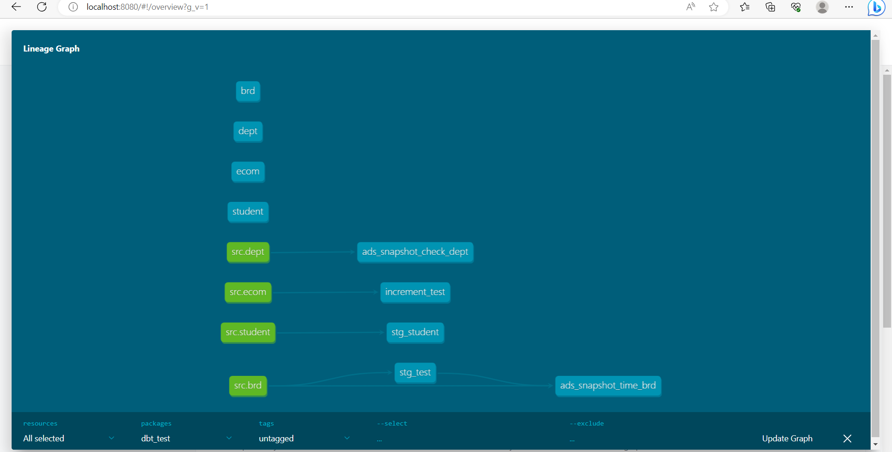

# DBT LABS 
## _dbt-test-snapshot-models_

[](https://www.n-able.biz/)


[]()

# Running Snapshot Models in dbt

## Introduction
The term "dbt snapshot" refers to a feature in dbt (data build tool) that allows you to capture and save a point-in-time snapshot of your data. Snapshots are useful for creating historical records or capturing data that might change over time.

In dbt, snapshots are select statements, defined within a snapshot block in a .sql file 

 ```sh
 
 ------------

 ```

## Prerequisites
Before running snapshot models, make sure you have the following prerequisites in place:
- dbt installed and configured
- Understanding of unique keys and their importance in snapshot processing
- Ensure your data source and target database support snapshot processing

## Getting Started

To get started with this project, follow the steps below:

## Prerequisites

- dbt (data build tool) installed on your local machine. You can install dbt by following the instructions at [dbt Installation Guide](https://docs.getdbt.com/dbt-cli/installation)

## Installation
### psql server setup - steps
### Prerequisites
Before you begin, ensure that you have the following prerequisites installed:
- Docker: You can download and install Docker from the official website (https://www.docker.com).

### **STEPS:**
#### Intall Docker #### 
##### 1. Download and install Docker by following the official instructions for your operating system. #####

##### 2. Once the installation is complete, verify that Docker is running by opening a terminal (or command prompt) and running the following command: ##### 
```sh
docker --version
```
You should see the Docker version information printed in the terminal.

#### Start PostgreSQL Container #### 
##### 1. Open a terminal (or command prompt).
##### 2. Run the following command to start a PostgreSQL container:
```sh
docker run --name postgres-container -e POSTGRES_PASSWORD=your_password -p 5432:5432 -d postgres
```
Replace **your_password** with a strong password of your choice.
##### 3. Wait for the container to start. You can check its status by running the command:
```sh
docker ps
```
you should see the postgres-container listed with a status of "Up" or "Running."
#### Install and Start pgAdmin
##### 1. Open a web browser and go to http://localhost:5050.
##### 2. Click on the "Click here" link to download the pgAdmin Docker image.
##### 3. Once the download is complete, go to your terminal (or command prompt) and run the following command to start the pgAdmin container:
   ```sh
   docker run --name pgadmin-container -p 5050:80 -e PGADMIN_DEFAULT_EMAIL=your_email -e PGADMIN_DEFAULT_PASSWORD=your_password -d dpage/pgadmin4
   ```
   Replace your_email and your_password with your desired email address and password for the pgAdmin login.
   
#### Configure pgAdmin
1. Go back to your web browser and access http://localhost:5050.
2. Log in to pgAdmin using the email and password you set in the previous step.
3. In the pgAdmin interface, click on "Add New Server" under the "Quick Links" section.
4. Enter the following details:
- **Name**: Give a name for your server (e.g., My PostgreSQL Server).
- **Host name/address**: postgres-container
- **Port**: 5432
- **Username**: postgres
- **Password**: The password you set for the PostgreSQL container.
6. Click "Save" to add the server.
7. You should now see the server listed in the left sidebar. Click on it to access and manage your PostgreSQL database using pgAdmin.
### Run this command to Clone the repository to your local machine:
   ```sh
   git clone https://github.com/koshitha-nable/dbt-test-features.git
   ```
### Navigate to the project directory:
   ```sh
  cd dbt-test-features
   ```
### Install the project dependencies:
```sh
pip install -r requirements.txt
```
### Configurations
1. Open the dbt_project.yml file and update the necessary configurations, such as **target database**, **credentials**, and other project-specific settings.
2. Configure your database connection by creating a **profiles.yml** file in the ~/.dbt directory. Refer to the [dbt Profiles Documentation](https://docs.getdbt.com/reference/warehouse-profiles) for more details.

### Model Configurations
**Snapshots can be configured in one of three ways:**

1. Using a config block within a snapshot
2. Using a config resource property in a .yml file
3. From the dbt_project.yml file, under the snapshots: key. To apply a configuration to a snapshot, or directory of snapshots, define the resource path as nested dictionary keys.
Snapshot configurations are applied hierarchically in the order above.

Refer [snapshot-configs](https://docs.getdbt.com/reference/snapshot-configs) for more details.
In this project we use config block within a snapshot to configure a model to run snapshots in dbt,
```sql
{{ config(
    target_schema="<string>",
    target_database="<string>",
    unique_key="<column_name_or_expression>",
    strategy="timestamp" | "check",
    updated_at="<column_name>",
    check_cols=["<column_name>"] | "all"
) }}
```
- The unique key for a given table, which is used by dbt to identify a unique row. 
- A strategy, whether timestamp or check 

**For a timestamp strategy,**

```sql


{{
        config(
          target_schema='snapshots',
          unique_key='id',
          strategy='timestamp',
          updated_at='updated_date'
        )
}}


-- select * from {{ source ('src','brd')}}
select * from {{ ref ('stg_test')}}

```
In the above example, we use the **{{ config( updated_at='updated_date')}}** to determine if a row has changed.Specify the columns that uniquely identify each record in the snapshot by adding the unique_key configuration within the model definition.

**For a check strategy,**
```sql


{{
        config(
          target_schema='snapshots',
          strategy='check',
          unique_key='id',
          check_cols=['travel_required','location']
        )
}}


select * from {{ source ('src','dept')}}
    

```
**{{config(check_cols = ['travel_required','location'])}}**  specifies the columns to be checked for data validity. In this case, it is set to ['travel_required','location'], indicating that the values in the 'travel_required' and 'location' columns will be validated during the data check.

### Data Source Configuration
Configure your data source to track historiacal changes. Depending on your database, you may need to set up logical replication or use triggers to capture changes.
In here we test snapshot model using simple department and border details tables

Please make sure to have these datasets available in your target database before running the dbt commands.

### Steps to Run Snapshot Models
Follow these steps to run snapshot models:

#### Building Data Models ####
**To build the data models and transform your data, follow these steps:**

### Navigate to the project directory:
   ```sh
  cd dbt_test
   ```

##### Test the database connection and show information for debugging purposes ####
```sh
dbt debug
```
##### Downloads dependencies for a project #####
```sh
dbt deps
```

##### Loads CSV files into the database #####
```sh
dbt seed
```
This command will load csv files located in the seed-paths directory of this dbt project into your data warehouse.
#####  To execute the compiled SQL transformations and materialize the models, use the following command: #####
```sh
dbt run
```
Running this command will create or update the tables/views defined in this project. It applies the transformations defined in the models and loads the data into the target database.

##### If you want to perform a full refresh of the data models, including dropping and recreating the tables/views, use the following command: #####

```sh
dbt run --full-refresh
```
This command ensures that the data models reflect the latest state of the source data.
#### Building Snapshot Models ####
**To build the snapshot models and capture hostorical data, run this commans:**

```sh
dbt snapshot
```
**To build the specified snapshot model and capture hostorical data, run this comman:**
```sh
dbt snapshot --select ads_snapshot_dept_checks
```
or
```sh
dbt snapshot --select ads_snapshot_time_brd
```
**On the first run**: dbt will create the initial snapshot table  

this will be the result set of your select statement, with additional columns including _**dbt_valid_from**_ and _**dbt_valid_to**_. 

- **On subsequent runs**: dbt will check which records have changed or if any new records have been created: 
-  _**dbt_valid_to**_ column will be updated for any existing records that have changed. 
The updated record and any new records will be inserted into the snapshot table. These records will now have _**dbt_valid_to = null**_ 


#### Testing ####
To test the project models and ensure the accuracy of the transformations, follow these step:**
##### To execute the tests defined in your project, use the following command: ##### 
```sh
dbt test
```
#### Documentation #### 
**To generate and view the documentation for this dbt project, follow these steps:**
##### 1. Generate the documentation by running the following command: #####
```sh
dbt docs generate
```
This command generates HTML pages documenting the models, tests, and macros in your project.
#####  2. Serve the documentation locally by running the following command: ##### 
```sh
dbt docs serve
```
This command starts a local web server to host the documentation. You can access it by opening your browser and visiting the provided URL.

###### Generated lineage graph


**Note**: Remember to generate the documentation before serving it.
Refer the [dbt commands](https://docs.getdbt.com/reference/dbt-commands) for more details.


